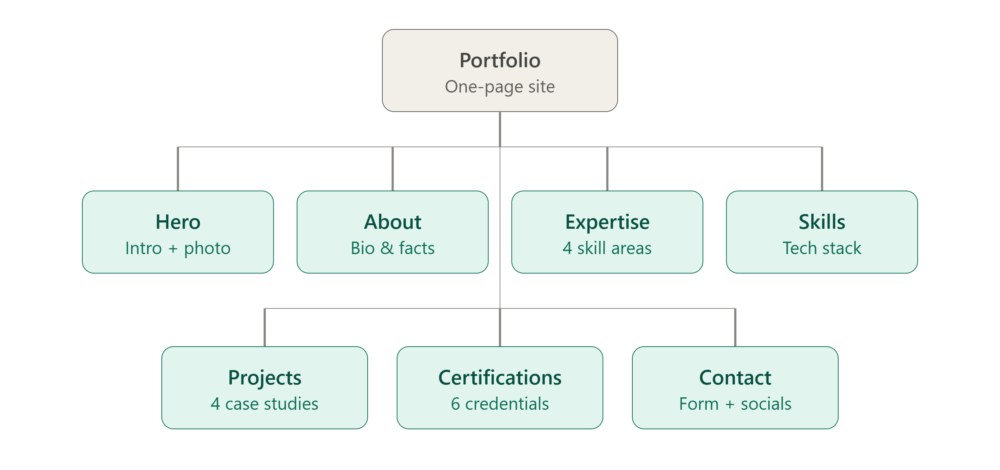
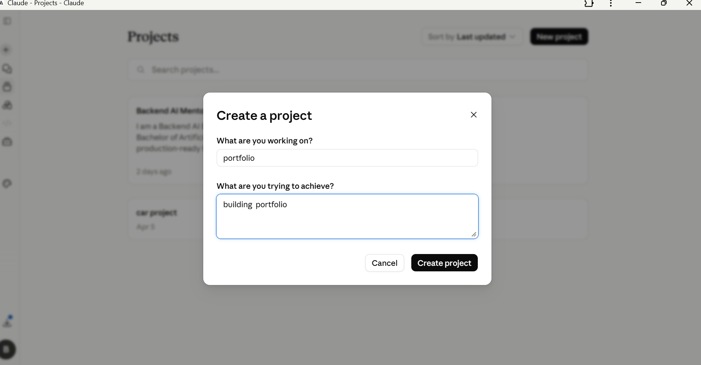
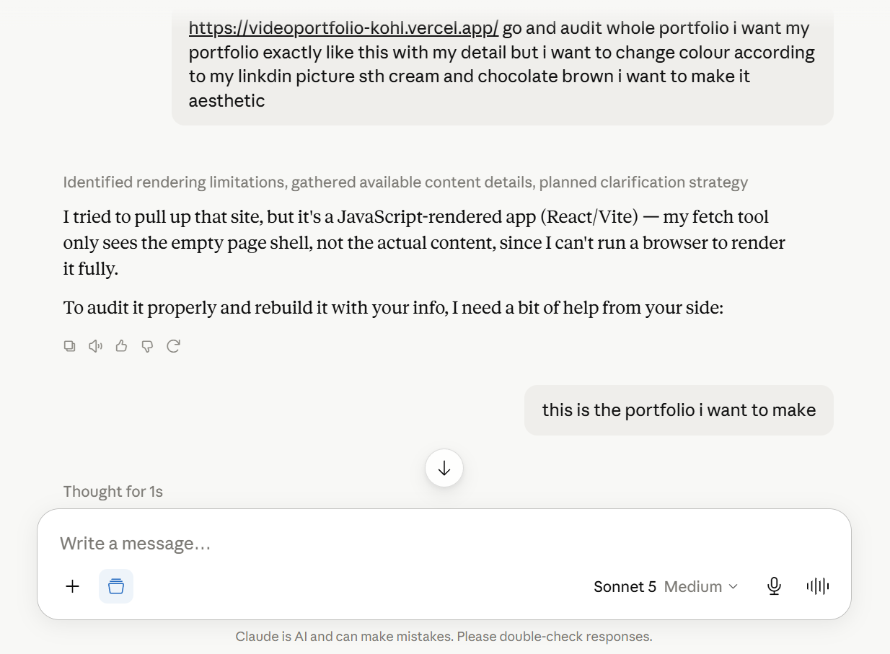
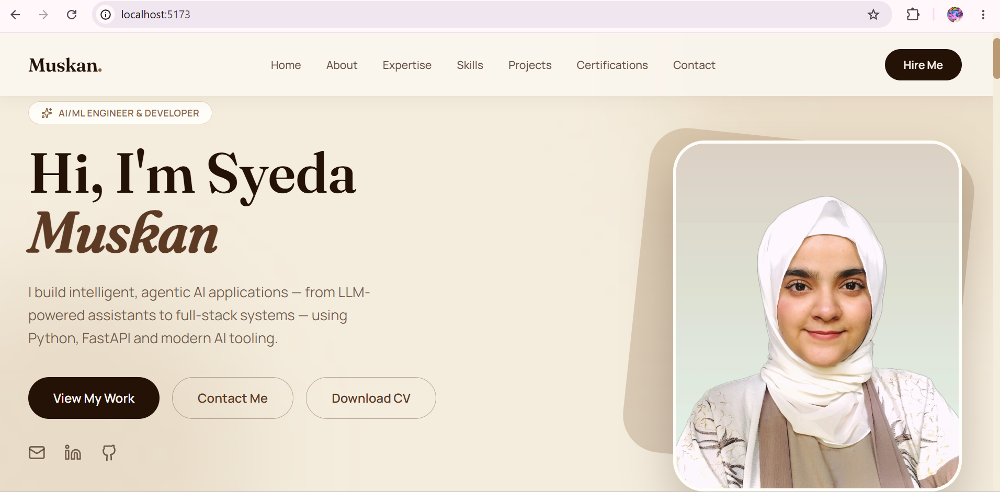

# 🗺️ FL-02 — Draw the Path: Portfolio Sitemap & AI-Assisted Planning

> **Track:** AI Fluency  
> **Assignment Code:** FL-02  
> **Phase:** Week 1 – Portfolio Planning  
> **Status:** ✅ Completed

---

# 📖 Assignment Overview

A portfolio is more than a collection of projects—it is a guided experience that helps recruiters understand who I am, what I can build, and why they should hire me.

The objective of this assignment was to intentionally design a simple portfolio structure, configure Claude as a long-term portfolio mentor, and use AI to critically review my design before continuing development.

Rather than adding pages without purpose, I focused on creating a portfolio where every section contributes toward a single goal:

> **Convince recruiters and hiring managers that I am capable of building production-ready AI and Backend systems and encourage them to contact me.**

---

# 🎯 Assignment Objectives

- Design a simple and purposeful portfolio sitemap.
- Keep only the pages that support my professional claim.
- Configure a Claude Project with custom instructions.
- Use Claude as a tutor to review my sitemap.
- Apply feedback to improve the portfolio structure.

---

# 👤 Target Audience

My portfolio is designed primarily for:

- Recruiters
- Hiring Managers
- Startup Founders
- Technical Interviewers

### Primary Action

> **Contact me for Backend AI Engineering internships or entry-level AI Engineering opportunities.**

---

# 🗺️ Portfolio Sitemap

The portfolio is intentionally designed as a **single-page website** to provide a smooth user experience while keeping navigation simple and focused.

Every section exists to strengthen my professional claim and guide visitors toward contacting me.

### Sitemap

---

# 🧩 Sitemap Breakdown

| Section | Purpose |
|----------|---------|
| **Hero** | Introduce myself with a clear value proposition and professional photo. |
| **About** | Share my background, education, and career goals. |
| **Expertise** | Highlight my strongest technical areas in Backend AI Engineering. |
| **Skills** | Present the technologies, frameworks, and tools I work with. |
| **Projects** | Showcase real-world AI and backend engineering projects that prove my abilities. |
| **Certifications** | Demonstrate continuous learning and professional development. |
| **Contact** | Provide multiple ways for recruiters to connect with me. |

---

# 💡 Professional Claim

The central message of my portfolio is:

> **I build intelligent, production-ready AI applications and backend systems using Python, FastAPI, LLMs, AI Agents, and modern AI engineering practices.**

Every section of the portfolio supports this statement.

---

# 🤖 Claude Project Configuration

To support the development of my portfolio throughout this internship, I created a dedicated Claude Project.

The project includes custom instructions that ask Claude to:

- Act as a portfolio mentor and tutor.
- Review my design decisions critically.
- Suggest improvements from a recruiter's perspective.
- Help me build a portfolio that demonstrates credibility through real projects rather than lengthy descriptions.

### Evidence

---

# 🧠 AI Pressure Test

After configuring the project, I asked Claude to evaluate my portfolio inspiration and suggest improvements before implementation.

The prompt focused on:

- Portfolio structure
- User experience
- Visual design
- Recruiter perspective
- Overall effectiveness

### Evidence

---

# 🔄 Improvements Implemented

Based on Claude's feedback, I made several design decisions:

- Simplified the portfolio into a clean single-page experience.
- Focused the homepage on communicating my value within the first few seconds.
- Prioritized projects as the strongest proof of my engineering skills.
- Selected a warm cream and chocolate brown color palette to create a consistent personal brand.
- Removed unnecessary sections that didn't contribute to my primary goal.
- Ensured each section naturally guides visitors toward contacting me.

---

# 💻 Portfolio Preview

### Homepage

---

---

# 📈 What Changed After the Pressure Test

| Before | After |
|----------|--------|
| Focused mainly on aesthetics. | Focused on communicating value to recruiters. |
| Considered adding more pages. | Kept the portfolio intentionally minimal. |
| Treated projects as one section among many. | Made projects the primary source of credibility. |
| Used AI for suggestions. | Used AI as a mentor to challenge and improve design decisions. |

---

# 💭 Reflection

This assignment changed how I think about portfolios. Initially, I viewed a portfolio as a website that showcases projects and technical skills. Through this exercise, I realized that an effective portfolio is actually a carefully designed user journey.

Instead of adding pages simply because other portfolios include them, I learned to ask whether each section contributes to my main objective: helping recruiters quickly understand my capabilities and encouraging them to contact me.

Using Claude as a tutor and design reviewer also reinforced an important lesson. AI is most valuable when it challenges my ideas, provides constructive feedback, and helps me improve my decisions—not when it replaces my own thinking.

This mindset will continue to guide how I build my portfolio and collaborate with AI throughout my internship.

---

# 🚀 Key Takeaways

- Every portfolio should have one clear audience.
- Every page should support one central professional claim.
- Projects provide stronger evidence than long descriptions.
- Simplicity improves usability and recruiter experience.
- AI is most effective as a collaborative mentor rather than an automatic solution generator.

---

# 🛠️ Tools Used

- Claude Projects
- Anthropic Claude (Sonnet 5)
- ChatGPT
- Figma (Sitemap Planning)
- React Portfolio
- Git & GitHub

---

# 📚 Resources

- Anthropic AI Fluency Course
- Claude Projects
- FlyRank AI Fluency Track
- Ethan Mollick – *Onboarding Your AI Intern*

---

## ✅ Assignment Deliverables

- ✔ Portfolio sitemap created
- ✔ Claude Project configured with custom instructions
- ✔ AI pressure test completed
- ✔ Portfolio improvements documented
- ✔ Portfolio preview included
- ✔ Reflection written